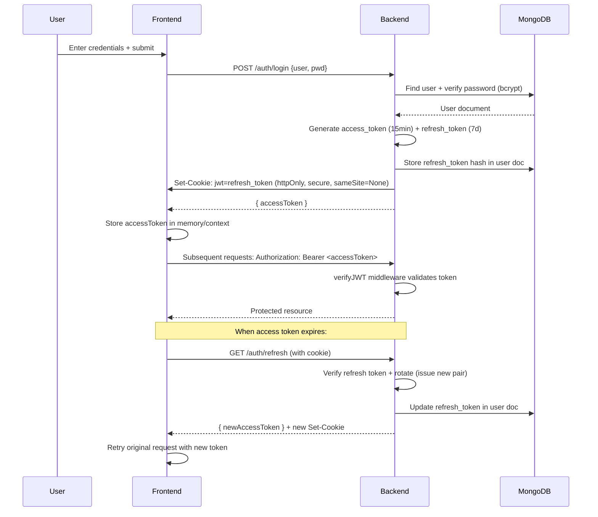

# 🛒 ShopCart Co. — Full-Stack E-Commerce Platform

<p align="center">
  
  
  
  
  
  
  
  <br />
  <strong>Secure • Scalable • Production-Ready</strong>
</p>

---

## 📋 Table of Contents

- [✨ Overview](#-overview)
- [🚀 Key Features](#-key-features)
- [🛠 Tech Stack](#-tech-stack)
- [📁 Project Structure](#-project-structure)
- [⚙️ Getting Started](#️-getting-started)
- [🔐 Environment Variables](#-environment-variables)
- [🔑 Authentication Flow](#-authentication-flow)
- [📡 API Reference](#-api-reference)
- [🛡 Security Practices](#-security-practices)
- [🧪 Testing](#-testing)
- [🚀 Deployment](#-deployment)
- [🤝 Contributing](#-contributing)
- [📄 License](#-license)

---

## ✨ Overview

**ShopCart Co.** is a production-grade, full-stack e-commerce application built to demonstrate real-world shopping platform functionality with enterprise-level security patterns.

> 🎯 **Core Philosophy**: Users can browse products freely without authentication. Login is required *only* when interacting with personalized features (cart, orders, account management), creating a frictionless discovery-to-purchase journey.

### 🎭 Role-Based Access

| Role | Permissions |
|------|------------|
| 👤 **Guest** | Browse products, search, filter, view details |
| 🔐 **User** | All guest features + cart management, order history, profile settings |
| 👑 **Admin** | All user features + product CRUD, user management, platform analytics |

---

## 🚀 Key Features

### 🛍 User Experience
```
✅ Public product browsing with search, pagination & filtering
✅ Persistent shopping cart (DB-backed, restored after login)
✅ One-click order creation with cart auto-clear
✅ Order history tracking
✅ Responsive, accessible UI with loading states & error handling
```

### 🔐 Security & Authentication
```
✅ JWT-based auth with short-lived access tokens (15min)
✅ Refresh token rotation stored in HTTP-only cookies
✅ Role-based access control (RBAC) middleware
✅ Rate limiting on auth endpoints (5 attempts/15min)
✅ CORS whitelist with credential support
✅ Input validation via Zod schemas
```

### 🖼 Media & Product Management
```
✅ Multi-image upload via Multer + Cloudinary integration
✅ Image validation: type (jpg/png/webp), size (≤5MB), count (1-5)
✅ Soft-delete support for products (isDeleted flag)
✅ Admin dashboard for product CRUD operations
```

### 📊 Admin Capabilities
```
✅ User management: enable/disable accounts
✅ Platform statistics: total users, products, orders
✅ Product analytics & inventory tracking
✅ Centralized logging (requests, errors)
```

---

## 🛠 Tech Stack

### Frontend (`/frontend`)
| Technology | Purpose | Version |
|-----------|---------|---------|
| **React** | UI Library | 18.2.0 |
| **TypeScript** | Type Safety | 5.4+ |
| **Vite** | Build Tool & Dev Server | 5.1.4 |
| **React Router** | Client-side Routing | 6.23+ |
| **Axios** | HTTP Client | 1.6+ |
| **JWT Decode** | Token Parsing | 4.0.0 |
| **ESLint + Prettier** | Code Quality | Latest |

### Backend (`/backend`)
| Technology | Purpose | Version |
|-----------|---------|---------|
| **Node.js** | Runtime | 18+ |
| **Express** | Web Framework | 4.19+ |
| **MongoDB + Mongoose** | Database & ODM | 8.3+ |
| **JWT** | Authentication | 9.0+ |
| **Bcrypt** | Password Hashing | 6.0+ |
| **Cloudinary** | Image Storage | 2.9+ |
| **Multer** | File Upload Handling | 1.4.5-lts |
| **Zod** | Request Validation | 3.23+ |
| **Express Rate Limit** | Brute-force Protection | 7.0+ |
| **Cookie Parser** | HTTP-only Cookie Handling | 1.4.6 |

### DevOps & Tooling
```bash
✅ Nodemon — Hot reload for development
✅ dotenv — Environment configuration management
✅ Morgan-style custom logger — Request auditing
✅ Centralized error handler — Consistent error responses
✅ .gitignore — Security-first defaults (no secrets committed)
```

---

## 📁 Project Structure

```
ShopCart-Co.-enhanced/
├── 📄 README.md                 # This file
├── 📦 package-lock.json         # Root lockfile (monorepo-style)
│
├── 🖥 backend/
│   ├── 📄 .env                  # Environment variables (git-ignored)
│   ├── 📄 package.json          # Backend dependencies & scripts
│   ├── 📁 logs/                 # Runtime logs (requests, errors)
│   │   ├── req.log
│   │   ├── err.log
│   │   └── requests.log
│   │
│   ├── 📁 src/
│   │   ├── 📄 app.js            # Express app configuration
│   │   ├── 📄 server.js         # Entry point: DB connect + server start
│   │   │
│   │   ├── 📁 config/           # Configuration modules
│   │   │   ├── allowedOrigins.js
│   │   │   ├── cloudinary.js
│   │   │   ├── corsOptions.js
│   │   │   ├── db.js            # MongoDB connection
│   │   │   └── roles.js         # Role constants (User:2001, Admin:5150)
│   │   │
│   │   ├── 📁 controllers/      # Business logic handlers
│   │   │   ├── admin.controller.js
│   │   │   ├── auth.controller.js
│   │   │   ├── cart.controller.js
│   │   │   ├── product.controller.js
│   │   │   └── ... (order, user, refresh, etc.)
│   │   │
│   │   ├── 📁 middleware/       # Reusable middleware
│   │   │   ├── credentials.js   # CORS credential header injector
│   │   │   ├── errorHandler.js  # Global error handler
│   │   │   ├── logger.js        # File-based request logger
│   │   │   ├── rateLimiter.js   # Auth endpoint protection
│   │   │   ├── upload.js        # Multer+Cloudinary config
│   │   │   ├── verifyJWT.js     # Access token validation
│   │   │   └── verifyRoles.js   # RBAC enforcement
│   │   │
│   │   ├── 📁 models/           # Mongoose schemas
│   │   │   ├── User.js          # username, roles, refreshToken, active
│   │   │   ├── Product.js       # name, price, images[], isDeleted
│   │   │   ├── Cart.js          # user, items[{productId, qty}]
│   │   │   └── Order.js         # user, items, totalAmount
│   │   │
│   │   ├── 📁 routes/           # API route definitions
│   │   │   ├── auth.routes.js   # /auth/login, /register, /refresh, /logout
│   │   │   ├── product.routes.js# Public + Admin product endpoints
│   │   │   ├── cart.routes.js   # Protected cart operations
│   │   │   └── ... (admin, order, user)
│   │   │
│   │   ├── 📁 services/         # Business logic abstraction
│   │   │   ├── cloudinary.service.js
│   │   │   └── stats.service.js
│   │   │
│   │   └── 📁 utils/            # Helpers
│   │       ├── apiError.js      # Custom error class
│   │       ├── apiResponse.js   # Standardized response wrapper
│   │       └── validators.js    # Reusable validation functions
│   │
│   └── 📄 ReadMe.md             # Backend-specific notes
│
├── 🎨 frontend/
│   ├── 📄 .env                  # Frontend env vars (VITE_*)
│   ├── 📄 package.json          # Frontend dependencies & scripts
│   ├── 📄 vite.config.ts        # Vite + React plugin config
│   ├── 📄 tsconfig.*.json       # TypeScript configuration
│   ├── 📄 eslint.config.js      # ESLint flat config
│   ├── 📄 index.html            # Entry HTML with SEO meta
│   │
│   ├── 📁 public/
│   │   └── _redirects          # SPA fallback for Netlify/Render
│   │
│   └── 📁 src/
│       ├── 📄 main.tsx          # React root + Context providers
│       ├── 📁 api/              # API service layer (axios instances)
│       │   ├── axios.ts         # axiosPublic + axiosPrivate instances
│       │   ├── auth.api.ts      # login, register, refresh, logout
│       │   ├── product.api.ts   # getProducts, createProduct, etc.
│       │   └── cart.api.ts      # cart CRUD operations
│       │
│       ├── 📁 app/              # App composition
│       │   ├── App.tsx          # Root component with Router
│       │   └── routes.tsx       # Route definitions + guards
│       │
│       ├── 📁 auth/             # Auth-related components
│       │   ├── Login.tsx
│       │   ├── Register.tsx
│       │   ├── RequireAuth.tsx  # Protected route wrapper
│       │   ├── RequireAdmin.tsx # Admin-only route wrapper
│       │   └── PersistLogin.tsx # Refresh token handler
│       │
│       ├── 📁 components/       # Reusable UI components
│       │   ├── common/          # Loader, ErrorBox, Pagination, NotFound
│       │   └── layout/          # Header, Footer
│       │
│       ├── 📁 context/          # React Context providers
│       │   ├── AuthContext.tsx  # Auth state management
│       │   └── CartContext.tsx  # Cart state + sync logic
│       │
│       ├── 📁 features/         # Feature-based modules
│       │   ├── products/        # ProductList, ProductDetail
│       │   ├── cart/            # CartPage, CartItem
│       │   ├── orders/          # OrderHistory
│       │   └── admin/           # Dashboard, ProductManager, UserTable
│       │
│       ├── 📁 hooks/            # Custom React hooks
│       │   ├── useAuth.ts       # Auth context accessor
│       │   ├── useCart.ts       # Cart context + API integration
│       │   └── useAxiosPrivate.ts# Auto-refresh token interceptor
│       │
│       ├── 📁 styles/           # Global CSS variables & resets
│       │   └── global.css
│       │
│       └── 📁 utils/            # Frontend utilities
│           └── tokenUtils.ts    # JWT decoding helpers
│
└── 📄 .gitignore                # Security-first ignore rules
```

---

## ⚙️ Getting Started

### Prerequisites
```bash
✅ Node.js >= 18.x
✅ MongoDB Atlas account (or local MongoDB 6+)
✅ Cloudinary account (for image uploads)
✅ npm or yarn package manager
```

### 1️⃣ Clone & Install
```bash
# Clone repository
git clone https://github.com/your-username/shopcart-co-enhanced.git
cd shopcart-co-enhanced

# Install backend dependencies
cd backend
npm install

# Install frontend dependencies
cd ../frontend
npm install
```

### 2️⃣ Configure Environment Variables

#### Backend (`backend/.env`)
```env
# Server
PORT=3500
NODE_ENV=development

# MongoDB (Atlas recommended)
MONGO_URI=mongodb+srv://<user>:<password>@cluster.mongodb.net/ShopCartDB?retryWrites=true&w=majority

# JWT Secrets (generate with: node -e "console.log(require('crypto').randomBytes(64).toString('hex'))")
ACCESS_TOKEN_SECRET=your_64_char_access_secret_here
REFRESH_TOKEN_SECRET=your_64_char_refresh_secret_here

# Cloudinary (https://cloudinary.com/console)
CLOUDINARY_CLOUD_NAME=your_cloud_name
CLOUDINARY_API_KEY=your_api_key
CLOUDINARY_API_SECRET=your_api_secret

# CORS
FRONTEND_URL=http://localhost:5173
```

#### Frontend (`frontend/.env`)
```env
# API Base URL
VITE_API_BASE_URL=http://localhost:3500

# Environment mode (for conditional logic)
VITE_ENV=development
```

> 🔐 **Security Note**: Never commit `.env` files. Use `.env.example` templates for team onboarding.

### 3️⃣ Run Development Servers

```bash
# Terminal 1: Start backend (with nodemon hot-reload)
cd backend
npm run dev
# → Server running on http://localhost:3500

# Terminal 2: Start frontend (Vite dev server)
cd frontend
npm run dev
# → App available at http://localhost:5173
```

### 4️⃣ Verify Setup
1. Visit `http://localhost:5173`
2. Browse products as guest
3. Register a new account → verify login persists cart
4. Login as admin (manually set `roles.Admin: XXXX` in MongoDB) → access `/admin` dashboard

---

## 🔐 Authentication Flow



### Token Lifecycle
| Token Type | Lifetime | Storage | Purpose |
|-----------|----------|---------|---------|
| `accessToken` | 15 minutes | Memory (React Context) | Authorize API requests |
| `refreshToken` | 7 days | HTTP-only cookie | Obtain new access tokens |

> 🔄 **Token Rotation**: Every refresh invalidates the old refresh token and issues a new pair — mitigating replay attacks.

---

## 📡 API Reference

### 🌐 Public Endpoints
```http
GET  /products?page=1&limit=10&search=laptop
→ { products: [...], totalPages: 5, currentPage: 1 }

GET  /products/:id
→ { _id, name, price, description, images[], stock, ... }
```

### 🔐 Protected Endpoints (User)
```http
GET  /cart
→ { items: [{ productId, qty, product: {...} }] }

POST /cart
→ { productId, qty } 
← 201 Created + updated cart

PUT  /cart
→ { productId, qty } (update quantity)

DELETE /cart/:productId
→ Remove item from cart

DELETE /cart
→ Clear entire cart

POST /orders
→ Create order from cart + clear cart
← 201 Created + order object

GET  /orders/me
→ User's order history

GET  /users/me
→ Current user profile (sans password/refreshToken)
```

### 👑 Admin Endpoints
```http
GET  /admin/stats
→ { totalUsers, totalProducts, totalOrders }

GET  /admin/users
→ List all users (select -password -refreshToken)

PATCH /admin/users/:id/disable
PATCH /admin/users/:id/enable

POST /products/admin          # Create product
PUT  /products/admin/:id      # Update product
DELETE /products/admin/:id    # Soft-delete (isDeleted=true)

# All admin routes require:
# - Valid JWT access token
# - roles array includes Admin (5150)
```

### 🔁 Token Management
```http
GET /auth/refresh
→ Uses HTTP-only cookie to issue new access+refresh tokens

POST /auth/logout
→ Clears refresh token cookie + invalidates server-side token
```

---

## 🛡 Security Practices

### ✅ Implemented Protections
```javascript
// 1. HTTP-only, Secure, SameSite=None cookies for refresh tokens
res.cookie("jwt", refreshToken, {
  httpOnly: true,
  secure: process.env.NODE_ENV === "production",
  sameSite: "None",
  maxAge: 7 * 24 * 60 * 60 * 1000
});

// 2. Rate limiting on auth endpoints (5 attempts / 15 min)
const loginLimiter = rateLimit({
  windowMs: 15 * 60 * 1000,
  max: 5,
  message: { message: "Too many login attempts. Try again later." }
});

// 3. Centralized error handling (no stack traces in prod)
app.use((err, req, res, next) => {
  console.error(err.stack); // Log internally
  res.status(res.statusCode !== 200 ? res.statusCode : 500).json({
    message: process.env.NODE_ENV === "production" 
      ? "Internal Server Error" 
      : err.message
  });
});

// 4. Input validation with Zod
const productSchema = z.object({
  name: z.string().min(1),
  price: z.number().positive(),
  // ...
});
app.post("/admin/products", validateRequest(productSchema), createProduct);

// 5. CORS whitelist + credential support
const corsOptions = {
  origin: (origin, callback) => {
    if (!origin || allowedOrigins.includes(origin)) callback(null, true);
    else callback(new Error("Not allowed by CORS"));
  },
  credentials: true
};
```

### 🔒 Best Practices Followed
- ✅ Passwords hashed with bcrypt (salt rounds: 10)
- ✅ Sensitive data excluded from API responses (`-password -refreshToken`)
- ✅ Soft deletes prevent accidental data loss
- ✅ Environment-based config (no hardcoded secrets)
- ✅ Request logging for audit trails
- ✅ Role checks at route *and* controller levels (defense in depth)

---

## 🧪 Testing (Planned)

```bash
# Backend: Jest + Supertest
npm test          # Run unit tests
npm run test:e2e  # Run API integration tests

# Frontend: Vitest + React Testing Library
npm test          # Component unit tests
npm run test:e2e  # Cypress E2E flows (planned)

# Coverage reports
npm run test:coverage
```

### Test Coverage Targets
| Module | Target | Current |
|--------|--------|---------|
| Auth Controllers | 90% | 🟡 Pending |
| Cart Logic | 85% | 🟡 Pending |
| Middleware | 95% | 🟡 Pending |
| API Routes | 80% | 🟡 Pending |

> 💡 *Testing infrastructure is scaffolded — contributions welcome!*

---

## 🚀 Deployment

### Backend (Render / Railway / AWS)
```yaml
# render.yaml example
services:
  - type: web
    name: shopcart-api
    env: node
    buildCommand: npm install
    startCommand: npm start
    envVars:
      - key: NODE_ENV
        value: production
      - key: MONGO_URI
        sync: false
      - key: ACCESS_TOKEN_SECRET
        sync: false
      # ... other secrets
```

### Frontend (Vercel / Netlify / Render Static)
```bash
# Build command
npm run build

# Output directory
dist/

# Redirect rule (SPA fallback)
/*    /index.html   200
```

### Database
- ✅ Use **MongoDB Atlas** for managed clusters
- ✅ Enable **IP whitelist** + **network access controls**
- ✅ Regular **backups** via Atlas snapshots
- ✅ Index critical fields: `username`, `productId`, `user` in carts/orders

### Production Checklist
```bash
[ ] Set NODE_ENV=production
[ ] Use strong, randomly generated JWT secrets
[ ] Enable HTTPS (Let's Encrypt / platform-provided)
[ ] Set cookie `secure: true` in production
[ ] Configure Cloudinary upload presets (unsigned for frontend)
[ ] Enable MongoDB Atlas backup + monitoring
[ ] Set up log aggregation (e.g., Papertrail, Datadog)
[ ] Add health check endpoint: GET /health → { status: "ok", uptime }
```

---

## 🤝 Contributing

We welcome contributions! Here's how to get started:

### 1. Fork & Clone
```bash
git fork https://github.com/your-org/shopcart-co-enhanced
git clone https://github.com/your-username/shopcart-co-enhanced.git
cd shopcart-co-enhanced
```

### 2. Create Feature Branch
```bash
git checkout -b feature/your-feature-name
```

### 3. Develop & Test
```bash
# Install dependencies
cd backend && npm install
cd ../frontend && npm install

# Run linters
cd backend && npm run lint
cd ../frontend && npm run lint

# Run tests (when implemented)
npm test
```

### 4. Commit Convention
```bash
# Use Conventional Commits
git commit -m "feat(auth): add password strength validator"
git commit -m "fix(cart): prevent negative quantities"
git commit -m "docs(readme): update API examples"
```

### 5. Submit PR
- ✅ Include description of changes
- ✅ Add/update tests if applicable
- ✅ Ensure CI passes (lint + tests)
- ✅ Request review from maintainers

### 🎯 Good First Issues
Look for labels:  
`good first issue` • `help wanted` • `documentation`

---

*Built with ❤️ from developer who value clean architecture, security, and user experience.* 🚀